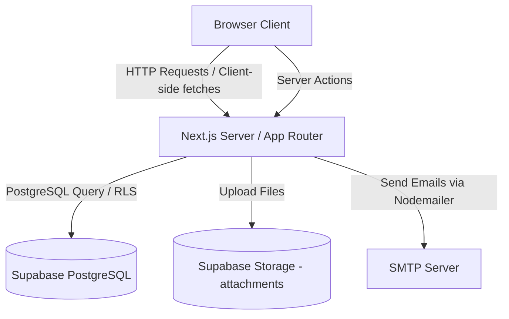

# System Architecture Overview - MNA Vietnam

Ngày cập nhật: 2026-07-31
Phiên bản: v2.0.0

## 1. Tổng quan hệ thống (High-Level Architecture)
MNA Vietnam được xây dựng trên mô hình **Next.js App Router (v14/v15)** kết hợp với **Supabase** đóng vai trò là Backend-as-a-Service (BaaS) cung cấp cơ sở dữ liệu PostgreSQL và Storage.

---

## 2. Các Thành phần Chính (Core Components)

### 2.1. Phân hệ Khách hàng (Frontend Portal - `src/app/(frontend)`)
- **Trang chủ (`/`):** Hiển thị banner Premium, thống kê dự án M&A, dự án tâm điểm, và các nút CTA.
- **Trang danh mục (`/danh-muc`):** Lọc dự án động theo loại giao dịch, tỉnh thành (34 tỉnh mới), loại bất động sản và tìm kiếm text.
- **Chi tiết dự án (`/du-an/[slug]`):** Xem thông tin chi tiết dự án (không hiển thị Quận/Huyện), gửi yêu cầu VDR bằng chữ ký tay điện tử.
- **Trang ký gửi (`/ky-gui`):** Form đăng ký ký gửi tài sản M&A của chủ dự án, hỗ trợ tải lên tài liệu pháp lý trực tiếp lên Supabase Storage.

### 2.2. Phân hệ Quản trị (Admin Portal - `src/app/(admin)`)
- **Xác thực Admin:** Quản lý phiên làm việc thông qua cookie mã hóa HMAC stateless bảo mật chống serverless session loss trên Vercel.
- **Dashboard (`/admin`):** Thống kê động tổng số dự án, số lead, VDR access, hiển thị biểu đồ SVG thống kê lead 6 tháng gần nhất và live logs lịch sử hoạt động.
- **Quản lý Leads (`/admin/leads`):** Phân trang (20 items/page), lọc nâng cao theo trạng thái, tháng tạo và khoảng ngày (Từ ngày - Đến ngày). Hỗ trợ tạo mới Lead thủ công và ẩn (soft delete).
- **Quản lý Dự án (`/admin/du-an`):** Đăng mới, chỉnh sửa thông tin dự án, ẩn dự án, sắp xếp và xuất dữ liệu ra file CSV tiếng Việt không lỗi font (UTF-8 BOM).
- **Phân hệ VDR (`/admin/vdr`):** Duyệt/Từ chối quyền tiếp cận Data Room ảo, hiển thị zoom chữ ký điện tử, xuất log audit VDR.
- **Khớp lệnh Thông minh (`/admin/matching`):** Thuật toán tự động tính điểm Matching Score (+50% Deal Type, +50% Province trùng khớp diacritics-normalized trong lời nhắn) giúp gợi ý dự án tốt nhất cho nhà đầu tư, ghi log trực tiếp vào `internal_notes`.
- **Master Data (`/admin/master-data`):** CRUD địa giới hành chính (34 Tỉnh mới, ẩn/hiện, sửa tên) và các danh mục chung (deal_type, project_type, legal_status...).

---

## 3. Quản lý Dữ liệu & Lưu trữ (Data & Storage)
- **Supabase PostgreSQL:** Lưu trữ dữ liệu quan hệ cho các bảng `projects`, `leads`, `settings`, `md_provinces`, và `master_data`.
- **Supabase Storage:** Lưu trữ tệp tin đính kèm từ form Ký gửi hoặc Tạo Lead thủ công trong bucket `attachments`.
- **Server Actions:** Thay thế phần lớn API thủ công để đảm bảo tính an toàn dữ liệu và tối ưu hóa SEO / SSR.
